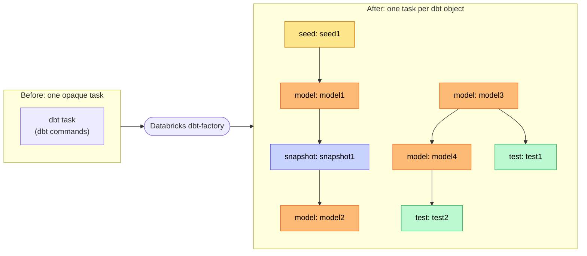
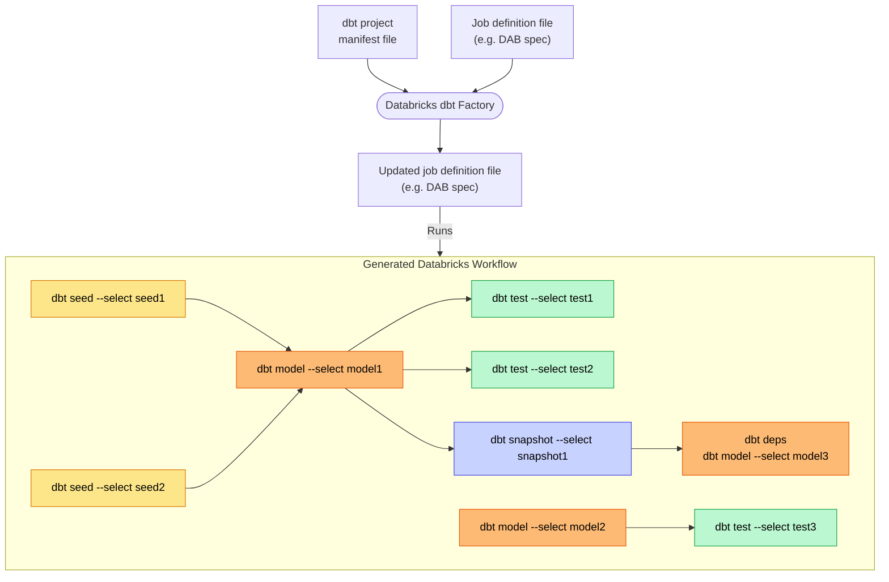

Databricks dbt factory
===

Databricks dbt Factory is a lightweight library that generates a Databricks Workflow from a dbt project. 
It creates individual Databricks Workflow tasks based on your dbt manifest for each dbt object type, covering dbt models, tests, seeds, and snapshots. 

The tool creates a new job specification, such as Databricks Assets Bundle (DAB), or can update an existing one.

[](https://github.com/mwojtyczka/databricks-dbt-factory/actions/workflows/push.yml)
[](https://pypi.org/project/databricks-dbt-factory)
[](https://pypi.org/project/databricks-dbt-factory)


-----

**Table of Contents**

- [Motivation](#motivation)
- [How it works](#benefits)
- [Installation](#installation)
- [Usage](#usage)
- [Task types](#task-types)
- [Contribution](#contribution)
- [License](#license)

# Motivation

By default, running a dbt project in Databricks Workflows treats an entire dbt project as a single execution unit — a black box.

Databricks dbt Factory changes that by updating Databricks Workflow specs to run dbt objects (models, tests, seeds, snapshots) as individual tasks.



### Benefits

✅ Faster execution - speed up dbt projects exeuction on Databricks

✅ Visibility & Simplified troubleshooting — Quickly pinpoint and fix issues at the model level.

✅ Enhanced logging & notifications — Gain detailed logs and precise error alerts for faster debugging.

✅ Improved retriability — Retry only the failed model tasks without rerunning the full project.

✅ Seamless testing — Automatically run dbt data tests on tables right after each model finishes, enabling faster validation and feedback.

# How it works



The tool reads the dbt manifest file and the existing DAB workflow definition, and generates a new definition.

# Installation

```shell
pip install databricks-dbt-factory
```

# Usage

The factory reads a **job template** (a minimal DAB-style YAML with an empty tasks list) and
a **dbt manifest**, then outputs a complete job definition with one task per dbt node.

## Job template

Create a minimal job template YAML. This is the skeleton the factory injects tasks into:

```yaml
resources:
  jobs:
    my_dbt_job:
      name: my_dbt_job
      queue:
        enabled: true
      environments:
      - environment_key: Default
        spec:
          client: '1'
          dependencies:
          - dbt-databricks
```

To use a workspace base environment instead of inline dependencies (recommended for
notebook tasks on serverless — requires Databricks CLI >= 0.292.0):

```yaml
      environments:
      - environment_key: Default
        spec:
          base_environment: "/Workspace/Shared/envs/my_base_env.yaml"
```

Note: `client` and `base_environment` are mutually exclusive — use one or the other.

## Generating native dbt tasks within Databricks Workflows

```shell
databricks_dbt_factory  \
  --dbt-manifest-path target/manifest.json \
  --input-job-spec-path job_template.yaml \
  --target-job-spec-path job_definition.yaml \
  --source GIT \
  --target dev
```

This generates `dbt_task` entries — the native Databricks dbt task type.

Note that `--input-job-spec-path` and `--target-job-spec-path` can be the same file, in which case the job spec is updated in place.

## Generating notebook tasks within Databricks Workflows (recommended for best performance)

This is the recommended way to run dbt on Databricks. It gives much faster start time. 
It uses a pre-cached base environment where `dbt-databricks` is already installed and ready on each new task which saves roughly 30 seconds of pip-install time per task. Native `dbt_task` on Serverless has to install dbt fresh every time.

**How it works.** A small runner notebook (shipped with this package) triggers dbt for each
task. dbt is lightweight — it parses your project, figures out what SQL to run, and sends that
SQL to your **SQL warehouse**. The actual model transformation runs in the warehouse, not in
the notebook. The notebook (and whatever compute runs it, serverless or a cluster) is just the
trigger — it doesn't crunch any data itself.

```shell
databricks_dbt_factory  \
  --dbt-manifest-path target/manifest.json \
  --input-job-spec-path job_template.yaml \
  --target-job-spec-path job_definition.yaml \
  --task-type notebook \
  --source GIT \
  --target dev
```

The packaged runner notebook (`run_dbt_command.py`) is copied next to the generated job spec
automatically. The `databricks bundle deploy` DAB command uploads it to the workspace along with the job.
Pass `--notebook-path <path>` if you want to pin the notebook elsewhere and manage it yourself.

> **When pinning `--notebook-path`, always provide `--project-directory` as an absolute workspace path to make sure the dbt project directory is resolved correctly.**
> In auto-copy mode the factory places the runner at the project root and rewrites paths accordingly. When you pin the notebook somewhere else, the factory can't know where your project lives relative to it — only an absolute `--project-directory` (e.g. `/Workspace/Users/you@example.com/my_dbt_project`) is guaranteed to work at runtime.

If your dbt project lives in the workspace instead of git (`--source WORKSPACE`), also pass `--project-directory` and `--profiles-directory` pointing at the absolute workspace paths of the uploaded project, e.g.:

```shell
databricks_dbt_factory ... \
  --task-type notebook \
  --source WORKSPACE \
  --project-directory /Workspace/Users/you@example.com/my_dbt_project \
  --profiles-directory /Workspace/Users/you@example.com/my_dbt_project
```

### Providing your own cluster (non-serverless mode)

To trigger tasks from a dedicated job cluster instead of serverless, use `--job-cluster-key`
and define the cluster in your job template. The cluster only runs dbt's lightweight
orchestration step (parse, compile, dispatch) — the actual SQL still executes on the SQL
warehouse configured in your `profiles.yml`. Small cluster is enough.

```yaml
resources:
  jobs:
    my_dbt_job:
      name: my_dbt_job
      job_clusters:
      - job_cluster_key: dbt_cluster
        new_cluster:
          spark_version: 16.2.x-scala2.12
          num_workers: 1
          node_type_id: i3.xlarge
```

```shell
databricks_dbt_factory  \
  --dbt-manifest-path target/manifest.json \
  --input-job-spec-path job_template.yaml \
  --target-job-spec-path job_definition.yaml \
  --task-type notebook \
  --job-cluster-key dbt_cluster \
  --source GIT \
  --target dev
```

## Arguments

- `--new-job-name` (type: str, optional, default: None): Optional job name. If provided, the existing job name in the job spec is updated.
- `--dbt-manifest-path` (type: str, required): Path to the dbt manifest file.
- `--input-job-spec-path` (type: str, required): Path to the input job spec file (the job template).
- `--target-job-spec-path` (type: str, required): Path to the target job spec file.
- `--target` (type: str, optional): dbt target to use. If not provided, the default target from the dbt profile will be used.
- `--source` (type: str, optional, default: None): Project source (`GIT` or `WORKSPACE`). If not provided, `WORKSPACE` will be used.
- `--task-type` (type: str, optional, default: "dbt"): Task type to generate — `dbt` for native dbt_task, `notebook` for notebook_task wrapper.
- `--notebook-path` (type: str, optional): Path to the dbt runner notebook used when `--task-type notebook`. If omitted, the packaged runner notebook is copied next to the generated job spec and referenced relatively, so `databricks bundle deploy` uploads it automatically. **When provided, also pass `--project-directory` as an absolute workspace path** — see the note in [Generating notebook tasks](#generating-notebook-tasks-within-databricks-workflows-recommended-for-best-performance).
- `--warehouse_id` (type: str, optional): SQL Warehouse ID. Only used with native dbt_task.
- `--schema` (type: str, optional): Metastore schema. Only used with native dbt_task.
- `--catalog` (type: str, optional): Metastore catalog. Only used with native dbt_task.
- `--profiles-directory` (type: str, optional): Path to the profiles directory.
- `--project-directory` (type: str, optional): Path to the dbt project directory.
- `--environment-key` (type: str, optional, default: Default): Key of the serverless environment. Mutually exclusive with `--job-cluster-key`.
- `--job-cluster-key` (type: str, optional): Job cluster key for running tasks on job compute instead of serverless. Mutually exclusive with `--environment-key`.
- `--extra-dbt-command-options` (type: str, optional, default: ""): Additional dbt command options to include.
- `--no-run-tests` (flag, default: tests enabled): Skip generating dbt test tasks. Tests are included by default.
- `--bundle-tests` (flag, default: disabled): **Performance boost** — bundle single-model tests per resource into one `dbt test --select <resource>` task. Fewer Databricks tasks means fewer task startups, fewer dbt cold starts, and noticeably faster end-to-end runtime for projects with many tests. Downstream models/seeds/snapshots gate on the upstream's `tests_<resource>` task so failing tests still halt the DAG. Cross-model tests are emitted as their own tasks with multi-resource deps. See [Test handling](#test-handling).
- `--enable-dbt-deps` (flag, default: disabled): Run `dbt deps` before each task.
- `--dbt-tasks-deps` (type: str, optional, default: None): Comma separated list of tasks for which dbt deps should be run (e.g. "diamonds_prices,second_dbt_model"). Only in effect if `--enable-dbt-deps` is set.
- `--dry-run` (flag, default: disabled): Print generated tasks without updating the job spec file.

You can also check all input arguments by running `databricks_dbt_factory --help`.

## DBT Tests handling

The factory produces tasks for dbt tests from the manifest by default (pass `--no-run-tests`
to skip them). Two modes are available, controlled by `--bundle-tests`:

### Per-test (default)

One Databricks task per dbt test node, running `dbt test --select <test_name>`. Each test task's
`depends_on` includes every model/seed/snapshot the test references, so multi-model tests
(e.g. `relationships`) only run after all their endpoints are built. **Downstream models are
gated only on error-severity tests**: every model/seed/snapshot task depends on the
`severity: error` test tasks attached to its upstream resources, so a failing error test skips
the downstream task. This matches `dbt build` semantics. **`severity: warn` tests still run as their own tasks but are
kept out of downstream `depends_on`** — they surface findings without cluttering the DAG or
blocking anything.

- **Pros:** per-test failures are individually visible in the Databricks UI; downstream
  execution halts on error-severity test failure just like `dbt build`; cross-model tests wait
  for every endpoint they reference; warn tests stay informational, no DAG gating.
- **Cons:** larger DAG (one task per test, and dbt projects routinely have many more tests than
  models); each downstream model's `depends_on` list grows with error-severity upstream tests.

### Bundled (`--bundle-tests`) — recommended for performance

**This is the faster mode.** For projects with many tests (most real-world projects have far
more tests than models), bundling dramatically reduces end-to-end runtime by cutting down on:

- **Task startup overhead.** Every Databricks task pays a cold-start tax. Going from N test
  tasks per resource down to one means N−1 fewer cold starts per resource.
- **Repeated dbt initialization.** Each `dbt test` invocation parses the manifest, connects to
  the warehouse, and sets up the adapter. Bundling reduces this from once-per-test to
  once-per-resource.
- **DAG coordination.** Fewer tasks means less scheduler pressure on the job run.

For a 100-model project with ~5 tests per model, that's ~500 test tasks collapsing to ~100 —
typically a large wall-clock win.

The factory classifies each dbt test node into one of two buckets based on its `depends_on`:

- **Single-model tests** (most tests: `unique`, `not_null`, `accepted_values`, column-level
  checks, …) — collapsed into one Databricks task per tested resource, with task key
  `tests_<resource_task_key>` (e.g. `tests_model_my_project_customers`) that runs all the
  resource's single-model tests together.

- **Cross-model tests** (e.g. `relationships`, custom tests that reference multiple models) —
  emitted as their own tasks, one per test node, with deps on **every** resource the test
  references. These run in parallel with the bundled tasks; they don't fit inside a bundle
  because their correctness requires all their endpoints to be built first.

Downstream models/seeds/snapshots that depend on a tested resource are rewired to depend on
the upstream's `tests_<resource>` task, so data only flows downstream after its upstream
single-model tests pass. Cross-model test tasks don't gate downstream execution — they run
as leaf assertions.

Severity handling: warn-severity test failures exit 0 in dbt, so the bundled `tests_<resource>`
task is green and downstream still runs. Error-severity failures exit non-zero, the
`tests_<resource>` task goes red, and downstream is skipped. Same end result as per-test mode
(warn ≠ blocking, error = blocking), just via dbt's exit code rather than our dep-graph
filtering.

- **Pros:** **faster** — fewer task startups and fewer dbt invocations translate directly into
  shorter end-to-end run times; smaller, cleaner DAG in the UI.
- **Cons:** per-test failure visibility is lost inside a bundle — a failure shows up as one red
  `tests_<resource>` task rather than a specific red `<test_name>` task in the UI; drill into
  the task logs to see which individual test(s) failed. (Cross-model test tasks retain their
  per-test visibility because they aren't bundled.)

## Task types

The factory supports two task types, controlled by `--task-type`:

### `dbt` (default)

Generates native Databricks `dbt_task` entries. This is the standard approach that
uses Databricks' built-in dbt integration. Works with both classic compute and serverless.

**Limitations on Serverless:** Native dbt tasks do not support workspace base environments (requiring installing dependencies on every task)
or environment variables. If you need either of these, use the `notebook` task type instead.

### `notebook`

Generates `notebook_task` entries that wrap dbt execution via the `dbtRunner` Python API.
Each task calls a shared runner notebook (`run_dbt_command.py`) with parameterized dbt commands.

**Advantages over native dbt_task:**
- Faster execution by avoiding cold start problem - all dependencies can be pre pre-cached inside  `base_environment`
- Supports running the dbt process on job compute via `--job-cluster-key` (SQL execution still uses the warehouse in `profiles.yml`)
- More flexibility - The runner notebook is editable. Want to load secrets from a scope before dbt runs? Run dbt, then call a Python API with the result? Emit a Slack message on failure? Tag the run with Git SHA? Add a few lines to the runner notebook.

#### Faster parsing on large projects (pre-built msgpack)

On large projects with many parallel tasks, most of each task's time is dbt **parsing** (re-reading
and content-hashing every project file and rebuilding the DAG), paid by every task and amplified by
contention on the shared workspace filesystem. The notebook runner skips parsing when a pre-built
msgpack sits next to the project: it loads `target/partial_parse.msgpack` into a manifest and injects
that into `dbtRunner`, and each task writes its artifacts to a private local dir instead of the shared
project `target/`.

**Which file, when.** A single local `dbt parse` produces both files:

| File | Stage | Role |
|---|---|---|
| `target/manifest.json` | Job generation (local) | **Read** by the factory (`--dbt-manifest-path`) to build the task DAG. Never used at runtime. |
| `target/partial_parse.msgpack` | Task runtime | **Read** by every task and injected into `dbtRunner` to skip parsing. **The only file you sync to the workspace**; tasks never rewrite it. |
| per-task local `target/` | Task runtime | **Written** by dbt (compiled SQL, etc.) to a private local dir, off the shared project `target/`. |

Build the msgpack with the **same dbt version your tasks run**. Optionally add `--extra-dbt-command-options
"--no-write-json --no-populate-cache"` to also skip JSON artifact writes and the warehouse
relation-cache scan.

> **Note:** In this mode a task's run artifacts (`run_results.json`, compiled SQL, etc.) are written to
> a private local dir and are **not** synced back to the shared workspace `target/`. The local dir is
> deleted when the task ends, so don't rely on inspecting workspace `target/` artifacts after a run. If
> a task fails, the failure detail is still surfaced in the task log. Leave the msgpack absent to fall
> back to the default behavior (parse per task, artifacts in the shared `target/`).


## End-to-end example

A complete working project is available at [mwojtyczka/dbt-demo](https://github.com/mwojtyczka/dbt-demo).
The steps below walk through running it end-to-end.

1. **Clone the demo project.**

    ```shell
    git clone https://github.com/mwojtyczka/dbt-demo.git
    cd dbt-demo
    ```

2. **Install dependencies.**

    ```shell
    pip install dbt-databricks databricks-dbt-factory
    ```

    Install the [Databricks CLI](https://docs.databricks.com/aws/en/dev-tools/cli/install):

    ```shell
    brew install databricks
    ```

3. **Set auth environment variables.** The demo's `profiles.yml` reads these to connect to
    Databricks:

    ```shell
    export DBT_HOST="https://<your-workspace>.cloud.databricks.com"
    export DBT_ACCESS_TOKEN="<your-pat>"
    ```

4. **Compile the dbt project** to produce dbt manifest file (`target/manifest.json`), which the factory reads:

    ```shell
    dbt compile
    ```

5. **Create Databricks Workflow.** This reads the manifest and the job template (`resources/dbt_sql_job.yml`) and writes a new, fully-expanded job spec to `resources/dbt_sql_job_explicit_tasks.yml` — one task per dbt node, wired up with the right dependencies:

    ```shell
    databricks_dbt_factory \
      --dbt-manifest-path target/manifest.json \
      --input-job-spec-path resources/dbt_sql_job.yml \
      --target-job-spec-path resources/dbt_sql_job_explicit_tasks.yml \
      --target '${bundle.target}' \
      --project-directory ../ \
      --profiles-directory . \
      --environment-key Default \
      --new-job-name dbt_sql_job_explicit_tasks
    ```

    For best performance, add `--task-type notebook` to the command above — it routes dbt execution through the packaged runner notebook (pre-cached base environments, faster cold starts). See [Generating notebook tasks](#generating-notebook-tasks-within-databricks-workflows-recommended-for-best-performance) for the full rationale.

6. **Authenticate the Databricks CLI to your workspace.** The `databricks.yml` in the demo references a specific profile (e.g. `FIELD-ENG`) under each target. Log in so that profile resolves:

    ```shell
    databricks auth login --host https://<your-workspace>.cloud.databricks.com
    ```

    You can verify with `databricks auth profiles`. If your `databricks.yml` uses a different profile name, pass `--profile <name>` on the login command to match.

7. **Deploy and run the bundle:**

    ```shell
    databricks bundle deploy --target dev
    databricks bundle run dbt_sql_job_explicit_tasks
    ```

   Open the run URL the CLI prints to watch the generated task graph execute in the Databricks UI.

# Contribution

See contribution guidance [here](CONTRIBUTING.md).

# License

`databricks-dbt-factory` is distributed under the terms of the [MIT](https://spdx.org/licenses/MIT.html) license.
