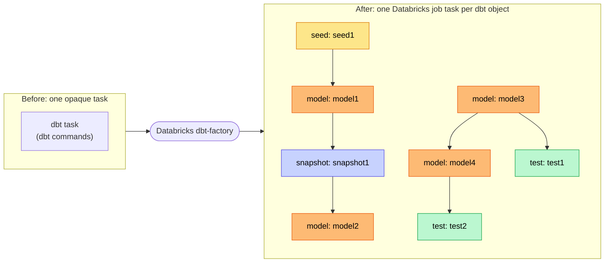
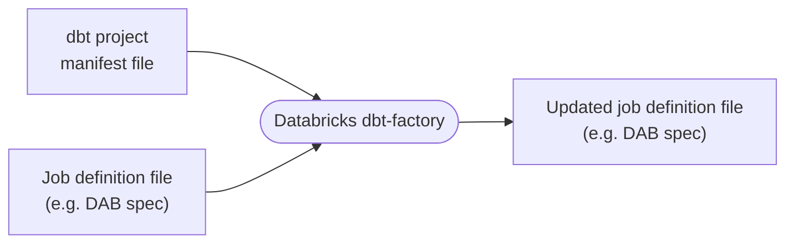
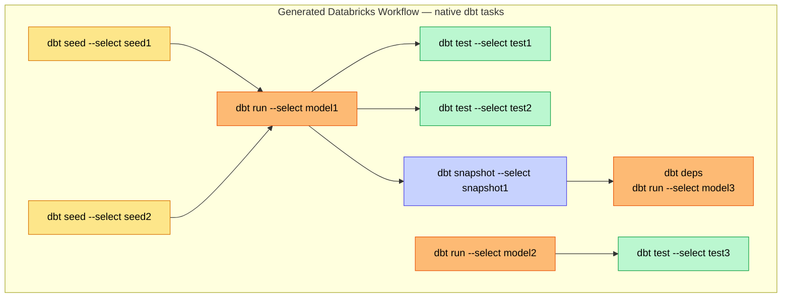
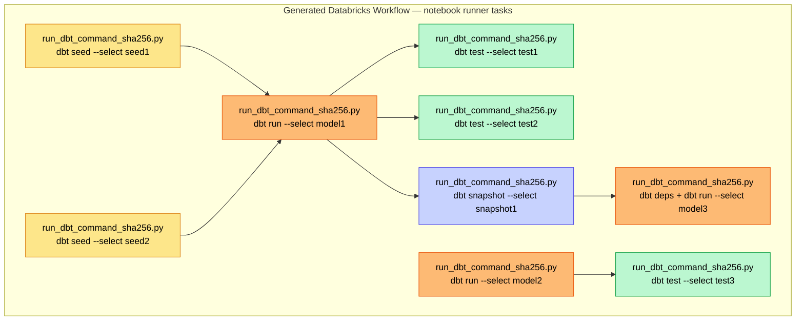

Databricks dbt factory
===

Databricks dbt-factory is a lightweight library and CLI that turns a dbt project into a granular Databricks Workflow — one task per dbt object (models, tests, seeds, and snapshots) instead of a single opaque dbt task.

It reads your dbt manifest and generates a new job specification — a Databricks Asset Bundle (DAB) or plain job YAML — or updates an existing one in place.

[](https://github.com/mwojtyczka/databricks-dbt-factory/actions/workflows/push.yml)
[](https://pypi.org/project/databricks-dbt-factory)
[](https://pypi.org/project/databricks-dbt-factory)


-----

**Table of Contents**

- [Motivation](#motivation)
- [How it works](#how-it-works)
- [Installation](#installation)
- [Usage](#usage)
- [Handling dbt tests](#handling-dbt-tests)
- [Task types](#task-types)
- [End-to-end example](#end-to-end-example)
- [Contribution](#contribution)
- [License](#license)

# Motivation

By default, running a dbt project in Databricks Workflows treats an entire dbt project as a single execution unit — a black box.

Databricks dbt-factory changes that by updating Databricks Workflow specs to run dbt objects (models, tests, seeds, snapshots) as individual tasks. The diagram below shows an example dbt project structure to illustrate the idea — the actual task graph is derived from your dbt manifest.


```mermaid
flowchart LR
    subgraph before["Before: one opaque task"]
        dbt["dbt task<br/>(dbt commands)"]
    end

    factory(["Databricks dbt-factory"])

    subgraph after["After: one Databricks job task per dbt object"]
        direction TB
        seed1["seed: seed1"] --> model1["model: model1"]
        model1 --> snap1["snapshot: snapshot1"]
        snap1 --> model2["model: model2"]
        model3["model: model3"] --> model4["model: model4"]
        model3 --> test1["test: test1"]
        model4 --> test2["test: test2"]
    end

    before --> factory --> after

    classDef seed fill:#fde68a,stroke:#d97706,color:#000
    classDef model fill:#fdba74,stroke:#ea580c,color:#000
    classDef test fill:#bbf7d0,stroke:#16a34a,color:#000
    classDef snapshot fill:#c7d2fe,stroke:#4f46e5,color:#000

    class seed1 seed
    class model1,model2,model3,model4 model
    class test1,test2 test
    class snap1 snapshot
```

### Benefits

✅ Faster execution — run dbt objects in parallel across Databricks tasks instead of one sequential run.

✅ Visibility & Simplified troubleshooting — Quickly pinpoint and fix issues at the model level.

✅ Enhanced logging & notifications — Gain detailed logs and precise error alerts for faster debugging.

✅ Improved retriability — Retry only the failed model tasks without rerunning the full project.

✅ Seamless testing — Automatically run dbt data tests on tables right after each model finishes, enabling faster validation and feedback.

# How it works

The tool reads the dbt manifest file and the existing DAB workflow definition, and generates a new definition.


```mermaid
flowchart LR
    manifest["dbt project<br/>manifest file"] --> factory(["Databricks dbt-factory"])
    jobdef["Job definition file<br/>(e.g. DAB spec)"] --> factory
    factory --> updated["Updated job definition file<br/>(e.g. DAB spec)"]
```

The generated tasks can be one of two types (see [Usage](#usage) for how to choose). The
workflow diagrams below use an example dbt project structure (a few seeds, models, snapshots,
and tests) to illustrate the generated task graph — your actual graph is derived from your own
dbt manifest and its dependencies.

## dbt tasks

With `--task-type dbt`, each dbt object becomes a native Databricks `dbt_task`:


```mermaid
flowchart LR
    subgraph workflow["Generated Databricks Workflow — native dbt tasks"]
        direction LR
        seed1["dbt seed --select seed1"] --> model1["dbt run --select model1"]
        seed2["dbt seed --select seed2"] --> model1
        model1 --> test1["dbt test --select test1"]
        model1 --> test2["dbt test --select test2"]
        model1 --> snap1["dbt snapshot --select snapshot1"]
        snap1 --> model3["dbt deps<br/>dbt run --select model3"]
        model2["dbt run --select model2"] --> test3["dbt test --select test3"]
    end

    classDef seed fill:#fde68a,stroke:#d97706,color:#000
    classDef model fill:#fdba74,stroke:#ea580c,color:#000
    classDef test fill:#bbf7d0,stroke:#16a34a,color:#000
    classDef snapshot fill:#c7d2fe,stroke:#4f46e5,color:#000

    class seed1,seed2 seed
    class model1,model2,model3 model
    class test1,test2,test3 test
    class snap1 snapshot
```

## Notebook runner tasks (default, recommended for best performance)

With the default task type, each task runs the packaged runner notebook
(`run_dbt_command_<sha256>.py`), which triggers the dbt commands programmatically using dbt core package. This gives much faster task
start times — see [Generating notebook tasks](#generating-notebook-tasks-within-databricks-workflows-recommended-for-best-performance).


```mermaid
flowchart LR
    subgraph workflow["Generated Databricks Workflow — notebook runner tasks"]
        direction LR
        seed1["run_dbt_command_sha256.py<br/>dbt seed --select seed1"] --> model1["run_dbt_command_sha256.py<br/>dbt run --select model1"]
        seed2["run_dbt_command_sha256.py<br/>dbt seed --select seed2"] --> model1
        model1 --> test1["run_dbt_command_sha256.py<br/>dbt test --select test1"]
        model1 --> test2["run_dbt_command_sha256.py<br/>dbt test --select test2"]
        model1 --> snap1["run_dbt_command_sha256.py<br/>dbt snapshot --select snapshot1"]
        snap1 --> model3["run_dbt_command_sha256.py<br/>dbt deps + dbt run --select model3"]
        model2["run_dbt_command_sha256.py<br/>dbt run --select model2"] --> test3["run_dbt_command_sha256.py<br/>dbt test --select test3"]
    end

    classDef seed fill:#fde68a,stroke:#d97706,color:#000
    classDef model fill:#fdba74,stroke:#ea580c,color:#000
    classDef test fill:#bbf7d0,stroke:#16a34a,color:#000
    classDef snapshot fill:#c7d2fe,stroke:#4f46e5,color:#000

    class seed1,seed2 seed
    class model1,model2,model3 model
    class test1,test2,test3 test
    class snap1 snapshot
```

# Installation

```shell
pip install databricks-dbt-factory
```

> **For production, pin the version** to get reproducible builds and avoid unexpected changes from new releases, e.g. `pip install databricks-dbt-factory==0.3.1`.

Check the installed version at any time:

```shell
databricks_dbt_factory --version
```

## Upgrading

Upgrade to the latest release:

```shell
pip install --upgrade databricks-dbt-factory
```

Or pin to a specific version (recommended for production):

```shell
pip install --upgrade databricks-dbt-factory==<version>
```

Run `databricks_dbt_factory --version` afterwards to confirm the upgrade.

# Usage

The factory reads a **job template** (a minimal DAB-style YAML with an empty tasks list) and
a **dbt manifest**, then outputs a complete job definition with one task per dbt node.

## Manifest and runtime graph contract

Selector exactness is relative to the supplied manifest. Each generated task invokes dbt against the
runtime project, and manifest schema v12 does not record enough parse context for the factory to prove
that runtime dbt will reconstruct the same graph. The runtime project and packages, dbt Core and adapter
versions, target, profile, vars, and any environment variables that affect parsing must produce the same
enabled resources and dependencies as the context that generated `manifest.json`.

Generate a manifest and job definition for each target, profile, vars set, or environment context that
can change the graph. Pass the matching target through the factory's dedicated `--target` argument.
`--extra-dbt-command-options` refuses explicit parse-context overrides (`--vars`, `--profile`,
`--profiles-dir`, `--project-dir`, and `--target`/`-t`) as well as selector overrides. Use
`--profiles-directory`, `--project-directory`, and `--target` where applicable. This validation prevents
an emitted command from explicitly replacing the manifest context; it cannot establish that the runtime
files and environment are otherwise identical.

## Job template

Create a minimal job template YAML. This is the skeleton the factory injects tasks into:

```yaml
resources:
  jobs:
    my_dbt_job:
      name: my_dbt_job
      queue:
        enabled: true
      environments:
      - environment_key: Default
        spec:
          environment_version: '5'
          dependencies:
          - dbt-databricks==<exact-version>
```

Replace `<exact-version>` with the exact `dbt-databricks` version used to generate
`target/manifest.json`. Use that same exact pin in every environment that executes the generated
commands, whether it backs native dbt tasks or notebook tasks. Databricks recommends
`dbt-databricks>=1.6.0`; matching the manifest-generation version exactly is the stronger
compatibility requirement.

The example uses [serverless environment version 5](https://docs.databricks.com/aws/en/release-notes/serverless/environment-version/five),
the current Databricks environment version. Use the latest version available in your workspace.

To use a workspace base environment instead of inline dependencies (recommended for
notebook tasks on serverless — requires Databricks CLI >= 0.292.0):

```yaml
      environments:
      - environment_key: Default
        spec:
          base_environment: "/Workspace/Shared/envs/my_base_env.yaml"
```

Note: `environment_version` and `base_environment` are mutually exclusive — use one or the other.

## Generating native dbt tasks within Databricks Workflows

```shell
databricks_dbt_factory  \
  --dbt-manifest-path target/manifest.json \
  --input-job-spec-path job_template.yaml \
  --target-job-spec-path job_definition.yaml \
  --task-type dbt \
  --source GIT \
  --target dev
```

This generates `dbt_task` entries — the native Databricks dbt task type.

Note that `--input-job-spec-path` and `--target-job-spec-path` can be the same file, in which case the job spec is updated in place.

## Generating notebook tasks within Databricks Workflows (recommended for best performance)

This is the recommended way to run dbt on Databricks. It gives much faster start time. 
It uses a pre-cached base environment where `dbt-databricks` is already installed and ready on each new task which saves roughly 30 seconds of pip-install time per task. Native `dbt_task` on Serverless has to install dbt fresh every time.

**How it works.** A small runner notebook (shipped with this package) triggers dbt for each
task. dbt is lightweight — it parses your project, figures out what SQL to run, and sends that
SQL to your **SQL warehouse**. The actual model transformation runs in the warehouse, not in
the notebook. The notebook (and whatever compute runs it, serverless or a cluster) is just the
trigger — it doesn't crunch any data itself.

```shell
databricks_dbt_factory  \
  --dbt-manifest-path target/manifest.json \
  --input-job-spec-path job_template.yaml \
  --target-job-spec-path job_definition.yaml \
  --task-type notebook \
  --source WORKSPACE \
  --target dev
```

The packaged runner is copied into the bundle as
`run_dbt_command_<64-lowercase-hex-SHA-256>.py`, where the suffix is the full SHA-256 of its
contents. Every generated task references that immutable relative path, and `databricks bundle
deploy` uploads it with the job. An unchanged runner reuses the same name; changed contents get a new
name without overwriting a runner referenced by an existing deployment.

Databricks bundle guidance uses `WORKSPACE` for notebooks deployed from the local bundle tree, so
auto-copy mode uses `--source WORKSPACE`. For a caller-managed notebook, use `GIT` only when
`--notebook-path` identifies a notebook inside the job's configured remote Git source. Pass
`--notebook-path <path>` to manage the runner yourself.

Both artifacts are normally prepared and validated before publication. The content-addressed runner is
atomically published or reused first. The factory then rechecks filesystem aliases between its
destination and the spec destination before atomically committing the job spec. This ordering prevents
a published spec from
referencing a runner that was not published first. Write failures leave the previous spec
unchanged and remove temporary files; a spec failure can leave a valid unreferenced runner for reuse.
The two replacements are not a cross-file transaction and are not guaranteed durable across a process
crash, operating-system crash, or power loss.

Generation assumes the output directory and its ancestors are trusted. It does not defend against an
untrusted concurrent process replacing directory entries or retargeting ancestor paths during publication.

> **When pinning `--notebook-path`, always provide `--project-directory` as an absolute workspace path to make sure the dbt project directory is resolved correctly.**
> With a relative `--project-directory`, auto-copy places the runner at that project root and rewrites paths accordingly; otherwise it places the runner next to the generated spec. When you pin the notebook somewhere else, the factory cannot infer where the project lives relative to it — only an absolute `--project-directory` (for example, `/Workspace/Users/you@example.com/my_dbt_project`) is guaranteed to work at runtime.

If your dbt project lives in the workspace instead of git (`--source WORKSPACE`), also pass `--project-directory` and `--profiles-directory` pointing at the absolute workspace paths of the uploaded project, e.g.:

```shell
databricks_dbt_factory ... \
  --task-type notebook \
  --source WORKSPACE \
  --project-directory /Workspace/Users/you@example.com/my_dbt_project \
  --profiles-directory /Workspace/Users/you@example.com/my_dbt_project
```

### Providing your own cluster (non-serverless mode)

To trigger tasks from a dedicated job cluster instead of serverless, use `--job-cluster-key`
and define the cluster in your job template. The cluster only runs dbt's lightweight
orchestration step (parse, compile, dispatch) — the actual SQL still executes on the SQL
warehouse configured in your `profiles.yml`. Small cluster is enough.

```yaml
resources:
  jobs:
    my_dbt_job:
      name: my_dbt_job
      job_clusters:
      - job_cluster_key: dbt_cluster
        new_cluster:
          spark_version: 16.2.x-scala2.12
          num_workers: 1
          node_type_id: i3.xlarge
```

```shell
databricks_dbt_factory  \
  --dbt-manifest-path target/manifest.json \
  --input-job-spec-path job_template.yaml \
  --target-job-spec-path job_definition.yaml \
  --task-type notebook \
  --job-cluster-key dbt_cluster \
  --source WORKSPACE \
  --target dev
```

## Arguments

- `--new-job-name` (type: str, optional, default: None): Optional job name. If provided, the existing job name in the job spec is updated.
- `--dbt-manifest-path` (type: str, required): Path to the dbt manifest file.
- `--input-job-spec-path` (type: str, required): Path to the input job spec file (the job template).
- `--target-job-spec-path` (type: str, required): Path to the target job spec file.
- `--target` (type: str, optional): dbt target to use. If not provided, the default target from the dbt profile will be used. The selected target must produce the same graph as the supplied manifest.
- `--source` (type: str, optional, default: None): Project source (`GIT` or `WORKSPACE`). Auto-copied notebook runners explicitly use `WORKSPACE`. Otherwise, omission emits no task-level source, so Databricks uses `GIT` when the job defines `git_source` and `WORKSPACE` otherwise. For notebook tasks, reserve explicit `GIT` for a caller-managed notebook in the job's remote Git source.
- `--task-type` (type: str, optional, default: "notebook"): Task type to generate — `notebook` for notebook_task wrapper, `dbt` for native dbt_task.
- `--notebook-path` (type: str, optional): Path to the dbt runner notebook used when `--task-type notebook`. If omitted, the packaged runner is copied into the bundle under its full content-addressed SHA-256 filename and referenced relatively, so `databricks bundle deploy` uploads it automatically. **When provided, also pass `--project-directory` as an absolute workspace path** — see the note in [Generating notebook tasks](#generating-notebook-tasks-within-databricks-workflows-recommended-for-best-performance).
- `--warehouse_id` (type: str, optional): SQL Warehouse ID. Only used with native dbt_task.
- `--schema` (type: str, optional): Metastore schema. Only used with native dbt_task.
- `--catalog` (type: str, optional): Metastore catalog. Only used with native dbt_task.
- `--profiles-directory` (type: str, optional): Runtime path to the profiles directory used for the supplied manifest context.
- `--project-directory` (type: str, optional): Runtime path to the dbt project represented by the supplied manifest.
- `--environment-key` (type: str, optional, default: Default): Key of the serverless environment. Mutually exclusive with `--job-cluster-key`.
- `--job-cluster-key` (type: str, optional): Job cluster key for running tasks on job compute instead of serverless. Mutually exclusive with `--environment-key`.
- `--extra-dbt-command-options` (type: str, optional, default: ""): Additional static dbt command options that do not alter resource selection or parse context. The factory rejects selector filters, Databricks dynamic value references, and explicit `--vars`, `--profile`, `--profiles-dir`, `--project-dir`, or `--target`/`-t` overrides. Use the dedicated factory arguments where available; the runtime parse context must match the supplied manifest. Allowed values that begin with a reserved short-option prefix, such as `-m` or `-s`, must use the unambiguous `--option=value` form.
- `--no-run-tests` (flag, default: tests enabled): Skip generating dbt test tasks. Tests are included by default.
- `--bundle-tests` (flag, default: disabled): **Performance boost** — bundle exact selectors for data tests with one testable parent (model, seed, snapshot, or source) and unit tests into one Databricks task per parent, using at most one `dbt test` union per indirect-selection mode. Data tests with zero or multiple testable parents remain standalone. Fewer Databricks tasks means fewer task startups and dbt cold starts. Downstream models/seeds/snapshots gate on the upstream's `<resource>_test` task. See [Handling dbt tests](#handling-dbt-tests).
- `--enable-dbt-deps` (flag, default: disabled): Run `dbt deps` before each task.
- `--dbt-tasks-deps` (type: str, optional, default: None): Comma separated list of tasks for which dbt deps should be run (e.g. "diamonds_prices,second_dbt_model"). Only in effect if `--enable-dbt-deps` is set.
- `--dry-run` (flag, default: disabled): Print generated tasks without updating the job spec file.
- `--version` (flag): Print the installed `databricks-dbt-factory` version.

You can also check all input arguments by running `databricks_dbt_factory --help`.

## Task keys

Each generated Databricks task gets a readable key derived from the dbt resource name plus the
resource type as a suffix:

| dbt node | task key |
| --- | --- |
| `model.my_project.customers` | `customers_model` |
| `seed.my_project.country_codes` | `country_codes_seed` |
| `snapshot.my_project.orders_snap` | `orders_snap_snapshot` |
| `test.my_project.unique_customers_id` | `unique_customers_id_test` |
| `source.my_project.raw.customers` | `raw_customers_test` |

When two nodes would produce the same key — a model name reused across packages, or the same custom
test name on two models — the colliding keys are disambiguated with the package name or dbt's test
hash (e.g. `pkg_a_customers_model` / `pkg_b_customers_model`), and long keys are truncated to
Databricks' 100-character limit. Keys are always unique, so a valid dbt project can never fail to
deploy on a duplicate task key.

Keys are stable as long as the set of resources is. Adding a resource whose key collides with an
existing disambiguated key can shift that key (e.g. to a `_2` suffix), which repoints that task's run
history and alerts.

## Databricks job limits

Databricks jobs support at most 1,000 tasks. The factory refuses to generate a job that exceeds that
limit. Enable `--bundle-tests` to reduce task count; if the job is still too large, split the workload
across jobs.

When notebook tasks share a job cluster, each concurrently running task uses a separate execution
context, and one cluster supports at most 150 execution contexts. Use bundled tests to reduce
concurrency pressure, or prefer serverless notebook tasks when the generated DAG needs greater
parallelism instead of concentrating it on one shared cluster.

## Handling dbt tests

The factory produces tasks for dbt tests (both data tests and unit tests) from the manifest by
default (pass `--no-run-tests` to skip them). Two modes are available, controlled by
`--bundle-tests`.

### How resources are addressed

Each task selects its resource by several facts at once, joined with commas (dbt reads a comma as
AND), so that exactly one resource matches:

```
dbt run  --select fqn:my_project.sql_model1.zzz_game_details,package:my_project,file:zzz_game_details.sql,resource_type:model
dbt test --select fqn:my_project.models.sql_model1.unique_zzz_game_details_game_id,package:my_project,file:schemas.yml,resource_type:test,test_name:unique
```

The `file:` term is included only when the manifest path has the same base name under POSIX and
Windows semantics. Manifest JSON does not record which platform produced paths containing a
backslash, so the factory omits that ambiguous discriminator and proves the remaining selector exact
instead. The notebook runner injects the pre-built manifest unchanged; generation fails if the other
terms cannot isolate the resource. This only affects manifests **generated on Windows**, whose nested paths carry backslash separators;
generating the manifest on the same POSIX platform the Databricks job runs on keeps the `file:` term
available.

Each selector is then checked against the manifest, because an FQN is a *prefix* over dbt's flattened
FQN rather than an identifier: a test named `check.nested` is also matched by its sibling `check`'s
selector. A directly exact test selector runs with indirect selection disabled. For an ambiguous test
with one parent whose fqn/name discriminator does not also select that parent, the factory can instead
intersect the test selector with the parent's exact selector under cautious indirect selection.
Generation fails when neither plan can establish exactness.

This proof covers the supplied manifest's graph. It depends on the runtime project producing that same
graph under the contract described in [Manifest and runtime graph contract](#manifest-and-runtime-graph-contract).

For other resources, the factory does not search alternate selector spellings after choosing a usable
FQN. It conservatively refuses an ambiguous generated selector even when a rare alternate spelling
might be exact.

When an ambiguous test needs its source as an exact parent scope, sources use dbt's own form,
`source:<package>.<source>.<table>`.

Resources dbt has disabled are skipped, including the few that stay in `nodes` with `enabled: false`
rather than moving to the manifest's `disabled` section.

#### When generation fails

Selectors name the `fqn:` method explicitly rather than letting dbt infer it from the value's shape, so
most awkward names cost nothing: a `/`, a `:`, or a `.sql` suffix in a resource name is matched literally.
What still cannot be expressed is a name containing a space, comma or one of `*?[]`, or one that ends
with something dbt reads as a graph operator (a trailing `+2`) — the `fqn:` prefix does not neutralise
those. Sources additionally cannot contain a `.`, since dbt's `source:` form uses it as its own separator.

Literal or incomplete braces, such as `orders{draft}` or `orders{{draft`, remain ordinary selector text
and are supported. Only a complete `{{...}}` sequence is unsafe: Databricks interprets it as a dynamic
value reference and substitutes it before dbt runs. The factory can omit an unsafe optional FQN or file
term when the remaining generated selector is exact. A source selector cannot omit any of its three
parts, so a complete reference in its assembled selector is refused even when dbt resolves it exactly.

Test tasks whose direct selector is exact pin `--indirect-selection empty`, so the task runs exactly the
named test and nothing dbt would otherwise sweep in alongside it. A provably safe ambiguous
single-parent test uses the exact-parent intersection described above with `--indirect-selection
cautious`. Bundled tasks preserve the mode required by each test's exact selection plan.

> **Pin the runtime adapter exactly.** Generated test commands use the `empty` indirect-selection mode,
> which requires dbt-core 1.5 or newer. Databricks recommends `dbt-databricks>=1.6.0`; select a supported
> version and pin that exact version both when generating the manifest and in every task runtime.

Generation also fails when a selector is valid but not *provably exact*. Equal or prefix-colliding test
FQNs are accepted when an exact single-parent scope isolates the intended node. A collision is refused
only when the direct selector is ambiguous and no such parent-scoped plan proves that the task runs the
intended test alone.

Either way the CLI exits 1 naming the resource and the remedy, and writes no output file, so a
partly-generated spec can never be deployed:

```
$ databricks_dbt_factory --dbt-manifest-path target/manifest.json ...
error: Cannot generate a task for 'orders+1' (models/orders+1.sql): dbt cannot select it uniquely. Rename ...
```

Almost always the resource's own name is fine and there is nothing to do. The case to know about is a
**file** name that trips the rules above, such as `models/orders+1.sql`: rename the file (the model's
name in `schema.yml` can stay as it is).

### Per-test (default)

One Databricks task per dbt test node, running `dbt test --select <selector>`. Each test task's
`depends_on` includes every model/seed/snapshot the test references, so multi-resource tests
(e.g. `relationships`) only run after all their endpoints are built. Exact direct test selectors run
with `--indirect-selection empty`. When dbt gives several single-parent tests the same direct selector
and the test discriminator does not select the parent itself, the task intersects that selector with the
exact parent selector under `--indirect-selection cautious`. This isolates equal-FQN generic tests,
installed-package collisions, and versioned unit-test clones.

**Every emitted test gates its first safe downstream frontier.** A test first becomes a dependency where
all of its refs are strict ancestors. Later nodes inherit that gate through their immediate emitted
dependencies instead of repeating the same test edge throughout the DAG. Tests whose full ref set is not
ancestral remain under this safe-subset rule and do not create a gate. This keeps `depends_on` compact and
acyclic while preserving `dbt build` ordering. A `severity: warn` test normally succeeds and therefore
does not block its dependants; if dbt is run with `--warn-error`, its failure blocks them without changing
the generated graph.

Unit tests get one task each, gated on the model under test. They have no severity and always fail
the run when they fail, so they gate downstream models like error-severity data tests. On a
*versioned* model, dbt clones the unit test per version but gives every clone the same FQN, name and
file. Each clone still receives its own parent-scoped task, depends only on its exact model version, and
runs only that version's assertions.

- **Pros:** per-test failures are individually visible in the Databricks UI; downstream
  execution halts on error-severity test failure just like `dbt build`; cross-resource tests wait
  for every referenced model, seed, or snapshot task; warn tests stay informational unless dbt is
  configured with `--warn-error`.
- **Cons:** larger DAG (one task per test, and dbt projects routinely have many more tests than
  models).

### Bundled (`--bundle-tests`) — recommended for performance

**This is the faster mode.** For projects with many tests (most real-world projects have far
more tests than models), bundling dramatically reduces end-to-end runtime by cutting down on:

- **Task startup overhead.** Every Databricks task pays a cold-start tax. Going from N test
  tasks per resource down to one means N−1 fewer cold starts per resource.
- **Repeated dbt initialization.** Each `dbt test` invocation parses the manifest, connects to
  the warehouse, and sets up the adapter. Bundling reduces this from once per test to at most twice
  per resource: one command for direct `empty` plans and one for parent-scoped `cautious` plans.
- **DAG coordination.** Fewer tasks means less scheduler pressure on the job run.

For a 100-model project with ~5 tests per model, that's ~500 test tasks collapsing to ~100 tasks —
typically a large wall-clock win even when a few tasks need both selection modes.

The factory classifies each dbt data-test node by the testable resources in its `depends_on`. Testable
resources are models, seeds, snapshots, and sources:

- **One testable parent** (most tests: `unique`, `not_null`, `accepted_values`, column-level
  checks, …) — bundled into one Databricks task per tested resource, with task key
  `<resource_name>_test` (e.g. `customers_test`). Unit tests join the bundle for their resolved model.

- **Zero or multiple testable parents** — emitted as standalone tasks, one per test node. This includes
  singular/custom tests that do not call `ref()` or `source()`, plus cross-resource tests such as
  `relationships`. A multi-resource task depends on every referenced model, seed, or snapshot task.
  Standalone tasks run alongside the bundles because no single resource owns them.

A resource's `<resource>_test` task contains the exact data-test and unit-test nodes assigned to that
resource. The factory builds the same exact per-test selection plan used in per-test mode, groups those
selectors by indirect-selection mode, and emits a deterministic union per mode. It never selects the
parent resource to discover tests indirectly. A bundle therefore has at most two `dbt test` commands
(`empty` followed by `cautious`), plus an optional `dbt deps` command. A model whose only test is a unit
test still gets a `<resource>_test` task.

Downstream models/seeds/snapshots that depend on a tested resource are rewired to depend on
the upstream's `<resource>_test` task, so data only flows downstream after its upstream
single-resource tests pass. Standalone test tasks don't gate downstream execution — they run as leaf
assertions.

Severity behaves the same as in per-test mode: dbt normally exits 0 for a warn-severity failure and
non-zero for an error-severity one, while `--warn-error` escalates warnings so the bundle blocks its
dependants.

- **Pros:** **faster** — fewer task startups and fewer dbt invocations translate directly into
  shorter end-to-end run times; smaller, cleaner DAG in the UI.
- **Cons:** per-test failure visibility is lost inside a bundle — a failure shows up as one red
  `<resource>_test` task rather than a specific red `<test_name>` task in the UI; drill into
  the task logs to see which individual test(s) failed. (Standalone test tasks retain their
  per-test visibility because they aren't bundled.)

## Task types

The factory supports two task types, controlled by `--task-type`:

### `dbt`

Generates native Databricks `dbt_task` entries. This is the standard approach that
uses Databricks' built-in dbt integration. Works with both classic compute and serverless.

**Limitations on Serverless:** Native dbt tasks do not support workspace base environments (requiring installing dependencies on every task)
or environment variables. If you need either of these, use the `notebook` task type instead.

### `notebook` (default)

Generates `notebook_task` entries that wrap dbt execution via the `dbtRunner` Python API.
Each task calls the shared content-addressed
`run_dbt_command_<64-lowercase-hex-SHA-256>.py` notebook with parameterized dbt commands.

**Advantages over native dbt_task:**
- Faster execution by avoiding the cold-start problem — all dependencies can be pre-cached inside `base_environment`
- Supports running the dbt process on job compute via `--job-cluster-key` (SQL execution still uses the warehouse in `profiles.yml`)
- More flexibility — pass `--notebook-path` to manage and extend your own runner when you need custom secrets, APIs, notifications, or run metadata.

**Limitation — authentication token lifetime:** the runner authenticates dbt with the notebook's
own credentials, captured once into `DBT_ACCESS_TOKEN` at the start of the run. That token is
short-lived (about one hour) and does not self-refresh, so a single task that runs longer than the
token's lifetime can fail mid-run with an authentication error. This is not a concern for typical
runs — dbt pushes the SQL to the warehouse and mostly waits, so individual tasks rarely exceed an
hour.

#### Faster parsing on large projects (pre-built msgpack)

On large projects with many parallel tasks, most of each task's time is dbt **parsing** (re-reading
and content-hashing every project file and rebuilding the DAG), paid by every task and amplified by
contention on the shared workspace filesystem. The notebook runner skips parsing when a pre-built
msgpack sits next to the project: it loads `target/partial_parse.msgpack` into a manifest and injects
that into `dbtRunner`, and each task writes its artifacts to a private local dir instead of the shared
project `target/`.

**Which file, when.** A single local `dbt parse` produces both files:

| File | Stage | Role |
|---|---|---|
| `target/manifest.json` | Job generation (local) | **Read** by the factory (`--dbt-manifest-path`) to build the task DAG. Never used at runtime. |
| `target/partial_parse.msgpack` | Task runtime | **Read** by every task and injected into `dbtRunner` to skip parsing. **The only file you sync to the workspace**; tasks never rewrite it. |
| per-task local `target/` | Task runtime | **Written** by dbt (compiled SQL, etc.) to a private local dir, off the shared project `target/`. |

Build the manifest and msgpack with the **exact same `dbt-databricks` version and parse context your
tasks run**. If target, profile, vars, or environment can change the graph, build and deploy a separate
pair for each context.
Optionally add `--extra-dbt-command-options "--no-write-json --no-populate-cache"` to also skip JSON
artifact writes and the warehouse relation-cache scan.

> **Note:** In this mode a task's run artifacts (`run_results.json`, compiled SQL, etc.) are written to
> a private local dir and are **not** synced back to the shared workspace `target/`. The local dir is
> deleted when the task ends, so don't rely on inspecting workspace `target/` artifacts after a run. If
> a task fails, the failure detail is still surfaced in the task log. Leave the msgpack absent to fall
> back to the default behavior (parse per task, artifacts in the shared `target/`).


## End-to-end example

A complete working project is available at [mwojtyczka/dbt-demo](https://github.com/mwojtyczka/dbt-demo).
The steps below walk through running it end-to-end.

1. **Clone the demo project.**

    ```shell
    git clone https://github.com/mwojtyczka/dbt-demo.git
    cd dbt-demo
    ```

2. **Install dependencies.**

    ```shell
    pip install "dbt-databricks==<exact-version>" databricks-dbt-factory
    ```

    Use the same `<exact-version>` in the Databricks task environment.

    Install the [Databricks CLI](https://docs.databricks.com/aws/en/dev-tools/cli/install):

    ```shell
    brew install databricks
    ```

3. **Set auth environment variables.** The demo's `profiles.yml` reads these to connect to
    Databricks:

    ```shell
    export DBT_HOST="https://<your-workspace>.cloud.databricks.com"
    export DBT_ACCESS_TOKEN="<your-pat>"
    ```

4. **Compile the dbt project** to produce dbt manifest file (`target/manifest.json`), which the factory reads:

    ```shell
    dbt compile --target dev
    ```

5. **Create Databricks Workflow.** This reads the manifest and the job template (`resources/dbt_sql_job.yml`) and writes a new, fully-expanded job spec to `resources/dbt_sql_job_explicit_tasks.yml` — one task per dbt node, wired up with the right dependencies:

    ```shell
    databricks_dbt_factory \
      --dbt-manifest-path target/manifest.json \
      --input-job-spec-path resources/dbt_sql_job.yml \
      --target-job-spec-path resources/dbt_sql_job_explicit_tasks.yml \
      --target dev \
      --project-directory ../ \
      --profiles-directory . \
      --source WORKSPACE \
      --environment-key Default \
      --new-job-name dbt_sql_job_explicit_tasks
    ```

    This example compiles and generates with the `dev` target. Repeat both steps with the same target
    value for every target whose parse context can produce a different graph.

    This uses the default `notebook` task type, which routes dbt execution through the packaged runner notebook (pre-cached base environments, faster cold starts). See [Generating notebook tasks](#generating-notebook-tasks-within-databricks-workflows-recommended-for-best-performance) for the full rationale, or pass `--task-type dbt` for native dbt tasks.

6. **Authenticate the Databricks CLI to your workspace.** The `databricks.yml` in the demo references a specific profile (e.g. `FIELD-ENG`) under each target. Log in so that profile resolves:

    ```shell
    databricks auth login --host https://<your-workspace>.cloud.databricks.com
    ```

    You can verify with `databricks auth profiles`. If your `databricks.yml` uses a different profile name, pass `--profile <name>` on the login command to match.

7. **Deploy and run the bundle:**

    ```shell
    databricks bundle deploy --target dev
    databricks bundle run dbt_sql_job_explicit_tasks
    ```

   Open the run URL the CLI prints to watch the generated task graph execute in the Databricks UI.

# Contribution

See contribution guidance [here](CONTRIBUTING.md).

# License

`databricks-dbt-factory` is distributed under the terms of the [MIT](https://spdx.org/licenses/MIT.html) license.
